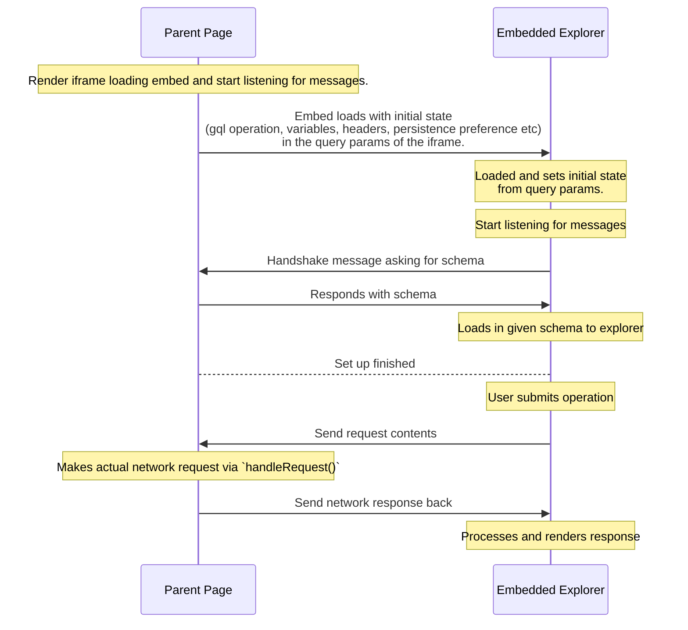
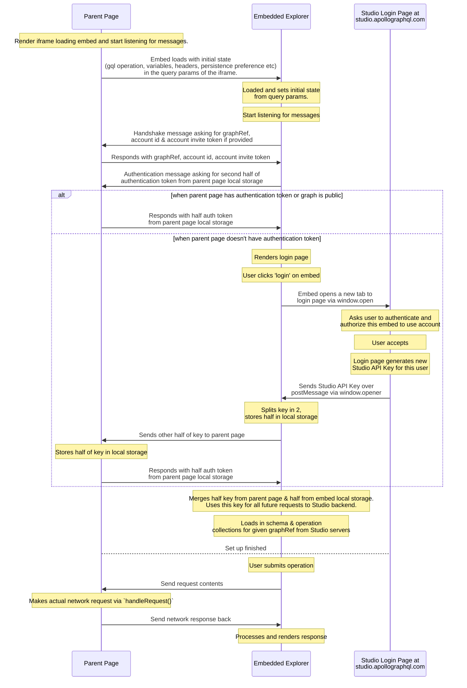

# Apollo Studio Embeddable Explorer

This repo hosts the source for Apollo Studio's Embeddable Explorer

[See docs for usage details](https://www.apollographql.com/docs/studio/embed-explorer/)

## Using the [@apollo/explorer npm package](https://www.npmjs.com/package/@apollo/explorer)

You can download the @apollo/explorer npm package with `npm install @apollo/explorer`. Then, you can import the ApolloExplorer class or ApolloExplorer component like so:

```
import { ApolloExplorer } from '@apollo/explorer';
import { ApolloExplorer } from '@apollo/explorer/react';
```

When you call the EmbeddedExplorer constructor with a `target` of an html div you have in your app, the Explorer will show up in an iframe in that element. Check out all the [configuration options](https://www.apollographql.com/docs/studio/explorer/embed-explorer/#options) for your graph.

### React

```
import { ApolloExplorer } from '@apollo/explorer/react';

function App() {

  return (
    <ApolloExplorer
      graphRef='acephei@current',
      endpointUrl='https://acephei-gateway.herokuapp.com',
      initialState={{
        document: `query Example {
me {
  id
}
}`,
        variables: {
          test: 'abcxyz',
        },
        displayOptions: {
          showHeadersAndEnvVars: true,
        },
      }}
    />
  );
}
```

### Vanilla JS

```
import { ApolloExplorer } from '@apollo/explorer';

function App() {

  ...
  new ApolloExplorer({
      target: '#embeddableExplorer',
      graphRef: 'acephei@current',
      endpointUrl: 'https://acephei-gateway.herokuapp.com',
      initialState: {
        document: `query Example {
me {
  id
}
}`,
        variables: {
          test: 'abcxyz',
        },
        displayOptions: {
          showHeadersAndEnvVars: true,
        },
      },
  })
  ...

}

...
// style the iframe for your site
<style>
  iframe {
    height: 100%;
    width: 100%;
    border: none;
  }
</style>
<div id="embeddableExplorer" />
```

### Examples from the raw cdn hosted umd file

- [Embedding a registered public graph](./src/examples/graphRef.html)
- [Usage by directly passing in schema](./src/examples/manualSchema.html)

## Developing embedded Explorer

`cd` into `packages/explorer` and run `npm run build:umd` to build umd files where EmbeddedExplorer is exposed on window.

Open `examples/embeddedExplorer/localDevelopmentExample.html` to test your changes. (if origin is not set, run localDevelopmentExample.html from `Live Server`)

Install the `Live Server` extension on VSCode, then go to `localDevelopmentExample.html` and click 'Go Live'


### Developing embedded Explorer with the React example

`cd` into `packages/explorer` and run `npm run build:cjs-esm` to build cjs & esm files where ApolloExplorer & ApolloExplorer React are named exports.

We have a React example app that uses our ApolloExplorer React component to render the embedded Explorer located in src/examples/react-example. To run this example, `npm run build` and `npm run start` in `react-example`. Make sure you delete the .parcel-cache folder before you rebuild for new changes. (TODO remove parcel caching)

### Sequence Diagrams

#### Connecting to unregistered graphs by directly passing in schema



#### Connecting to registered graphs by authentication


